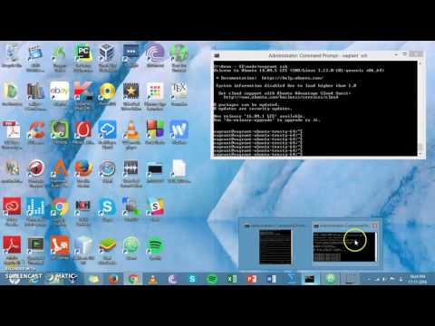

# HW5-ArunJaganathan
## Unity ID: ajagana
## Name : Arun Jaganathan

### Instructions:

Install ansible in one of the VM using the following code

    sudo apt-get update
    sudo apt-get -y install git make vim python-dev python-pip libffi-dev libssl-dev libxml2-dev libxslt1-dev libjpeg8-dev zlib1g-dev

    sudo pip install ansible

Once the node VM is setup - (Node0.key file added and inventory file created in ansible VM), run the following commands in the ansible VM

    ansible-playbook -s node_setup.yml -i inventory
    ansible-playbook -s node_task.yml -i inventory

The first command is to execute the setup playbook and the second one is for the executing the tasks

### Screencast

Link : Click Here[https://youtu.be/RPMPBxeojOw]
